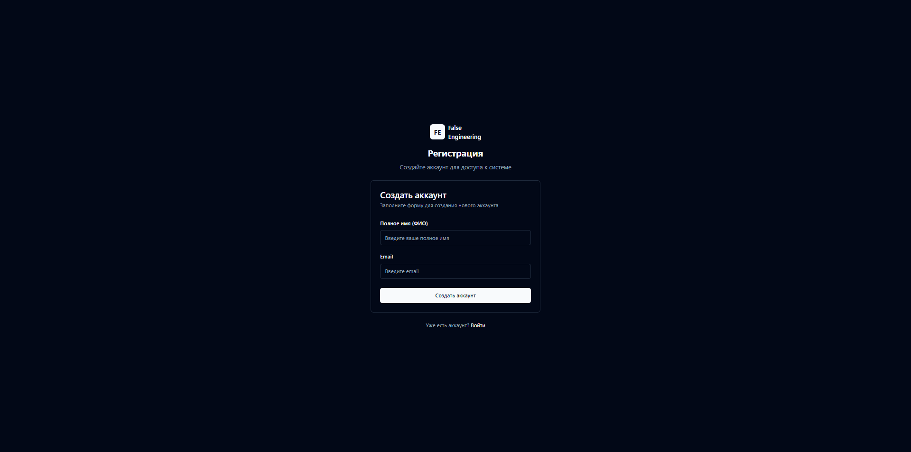
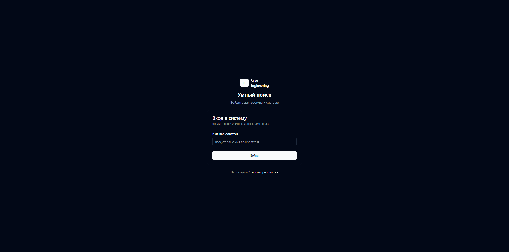
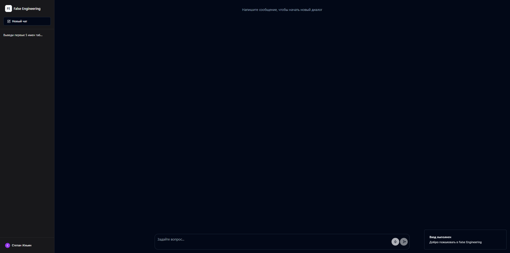
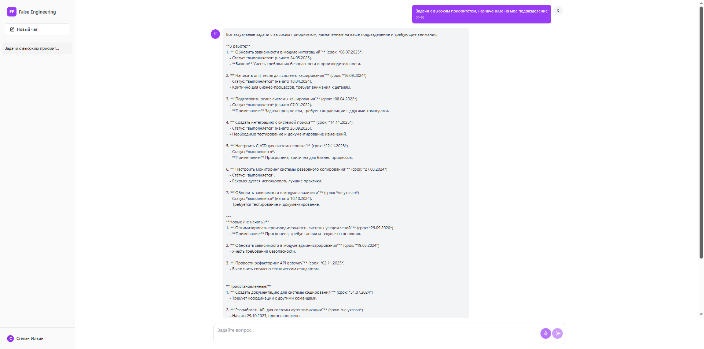
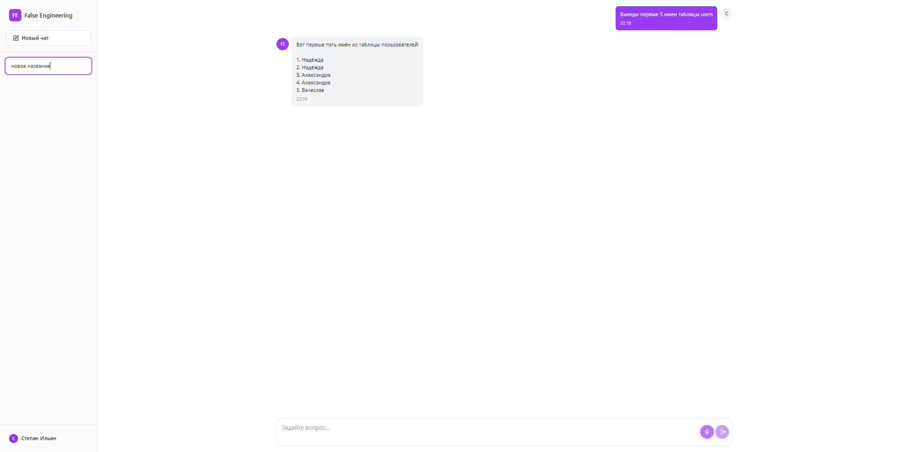
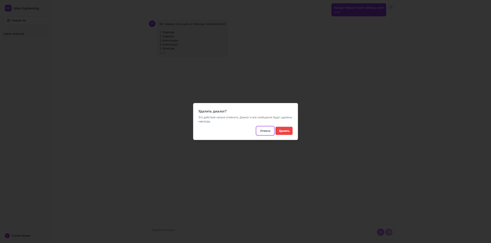
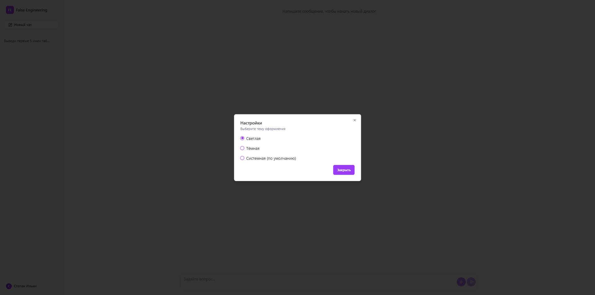
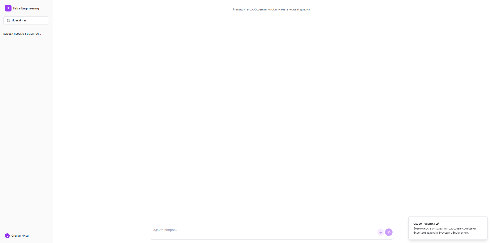

# False Engineering

---

## Описание

**False Engineering** — это интеллектуальная поисковая система нового поколения, объединяющая удобный интерфейс, быстрый бэкенд на FastAPI и возможности генеративного ИИ (LangChain + Qdrant).
Система позволяет не только находить данные, но и анализировать их, помогая бизнесу принимать решения быстрее.

---

## ✨ Возможности

- 🔍 Умный поиск с ИИ — семантический поиск и ответы на естественном языке.
- 🧠 Интеграция с LangChain — обработка контекста, векторные запросы, работа с графами знаний.
- 💬 Диалоги с ИИ — возможность вести разговор с системой, сохранять и переименовывать диалоги.
- 👥 Регистрация и аутентификация — управление пользователями.
- 🎨 Современный интерфейс — React + Vite + shadcn/ui + Tailwind CSS.
- 🚀 Производительный бэкенд — FastAPI + PostgreSQL + Qdrant.

---

## 🎞️ Demo (GIF)

### Animation


---

## 🖼️ Скриншоты

### Registration



### Login



### Search



### Dialog



### Rename dialog



### Delete dialog



### Settings



### Toaster



---

## 🛠️ Технологический стек

### Frontend

- React 18 + Vite 5
- TypeScript
- TailwindCSS + shadcn/ui + Radix UI
- React Query (TanStack)
- React Router
- Recharts, date-fns

### Backend

- FastAPI + Uvicorn
- PostgreSQL (через psycopg2)
- Qdrant (векторное хранилище)
- LangChain / LangGraph
- Pydantic

---

## ⚙️ Установка и запуск

1. Клонирование репозитория

```bash
git clone https://github.com/your-org/false_engineering.git
cd false_engineering
```

2. Настройка окружения

Создайте `.env` файл в корне:

```env
SECRET_KEY=your_secret_key
POSTGRES_USER=postgres
POSTGRES_PASSWORD=postgres
POSTGRES_DB=task_db
```

3. Запуск через Docker

```bash
docker-compose up --build
```

Будут подняты сервисы:

- База данных PostgreSQL (порт 5432)
- Qdrant (порт 6333)
- Backend FastAPI (порт 8000)
- Frontend Vite (порт 8080)

4. Доступ

- Frontend: http://localhost:8080
- Backend API: http://localhost:8000/docs
- Qdrant UI: http://localhost:6333/dashboard

---

## 📂 Структура проекта

```bash
false_engineering/
│── backend/ # API, FastAPI, LangChain-интеграция
│── frontend/ # Vite + React + shadcn/ui
│── docker-compose.yml
│── .env
└──README.md
```

---

## 🚧 Дальнейшие планы

- Подключение LLM моделей (через OpenAI API или локальные LLaMA).
- Ролевая система доступа.
- Интеграция с корпоративными сервисами.
- Аналитические дашборды.

---

## 🤝 Авторы

### 👑 Lead / Backend

<a href="https://github.com/crystalaegis122">
  
</a>  
<br/>
<a href="https://github.com/crystalaegis122"><b>crystalaegis122</b></a>

---

### 🎨 Frontend / Fullstack

<a href="https://github.com/Bogdan-Afanasev">
  
</a>  
<br/>
<a href="https://github.com/Bogdan-Afanasev"><b>Богдан Афанасьев</b></a>

---

### 🤖 AI Developer

<a href="https://github.com/mgbdd">
  
</a>  
<br/>
<a href="https://github.com/mgbdd"><b>mgbdd</b></a>

---

## ⚖️ Лицензия

Этот проект создан исключительно в учебных целях. Все использованные API, стили и технологии принадлежат их соответствующим владельцам. Проект не предназначен для коммерческого использования.

---

Наслаждайтесь — и не забудьте ⭐ звезду, если вам понравилось!
